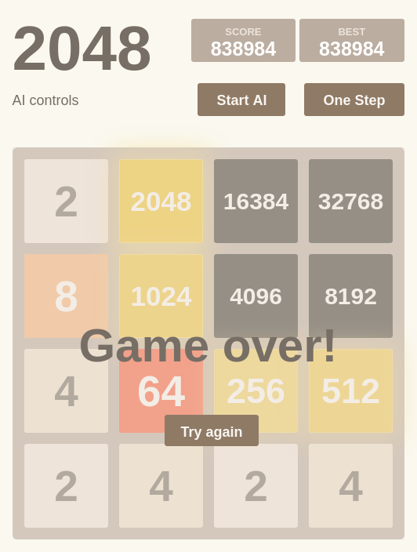

# 2048 AI

An AI made for the game 2048. The AI can reach 16384 most of the time and
sometimes even reach 32768. Note, this is a newer and improved version of the
AI, rewritten in Zig. You can find the old C++ version
[here](https://github.com/ziap/2048-ai/tree/old-cpp)



## Algorithm

This AI is an Expectimax search run in parallel on your browser without any
back-end server or browser control. You can even run it on a mobile device!

The AI uses a worker pool to search multiple subtrees in parallel. The search
result of the subtrees are then aggregated to pick the final move. Each worker
is a WebAssembly module compiled from Zig.

Because the search is done in parallel and the workers use heavy optimizations
like bitboard representation, lookup tables,... the AI can search very deep,
especially in difficult positions, very quickly.

## Benchmark

This repository also includes a console application to run the AI without the
overhead of the web platform. It also allows for reproducible benchmarking of
the AI playing multiple games in parallel. Here's the current benchmark
results:

| Budget | Speed          | Avg Score | % 65536 | % 32768 | % 16384 | % 8192 |
| ------ | -------------- | --------- | ------- | ------- | ------- | ------ |
| 2^15   | 1523.2 moves/s | 313838    | 0.0     | 9.1     | 72.1    | 95.8   |
| 2^17   | 397.7 moves/s  | 389180    | 0.0     | 21.6    | 85.0    | 97.5   |
| 2^19   | 119.5 moves/s  | 468109    | 0.1     | 39.1    | 91.1    | 98.9   |
| 2^21   | 23.8 moves/s   | 530970    | 0.2     | 51.7    | 94.7    | 99.1   |

The speed is computed by averaging 10 games in single-threaded mode, on an AMD
Ryzen 5 5600G CPU. The average score and tile reaching rate is computed by
running 1000 games across 12 CPU cores. These results are fully reproducible
using the seed `benchmark`, see the usage [below](#usage).

## Features

Efficient bitboard implementation:
- Fast move generation and leaf evaluation using table lookup
- Highly optimized bitwise operations
- Use 64-bit for search and 80-bit for simulation supporting the 65536 tile

Advanced search techniques:
- Dynamic depth allocation using memory-constrained BFS
- Approximated deduplication with hash sorting and transposition table
- Prune formation breaking moves

Web version:
- Subtree parallelism with a worker pool
- Shared, lock-free transposition table

Console version:
- Simulating and solving multiple games in parallel
- Fully deterministic benchmark even under parallelism
- Search budget configuration

Memory optimizations:
- No dynamic allocation during search
- Console version: allocate everything at startup
- Web version: only use stack and static memory
- Cache-efficient data structures

## Usage

Get [Zig](https://ziglang.org/) version
[0.16.0](https://ziglang.org/download/#release-0.16.0), and compile everything
with optimization using the following command:

```sh
zig build --release=fast
```

Use `zig build -l` and `zig build -h` to customize the compilation. Run the
console application using:

```sh
zig-out/bin/2048 [options]
```

Available options:

```
  -i, --iter <u32>     Number of iterations (default: 1)
  -b, --budget <u32>   Processing budget (default: 524288)
  -t, --threads <u32>  Number of threads (default: auto)
  -s, --seed <bytes>   Seed for the PRNG (default: random)
  -h, --help           Display this help message
```

The web version is already hosted [here](https://ziap.github.io/2048-ai). For
hosting locally, just compile everything as shown above and use any HTTP
server, for example:

```sh
# Serve the app locally with your HTTP server of choice
python3 -m http.server 8080

# Launch the app in your browser of choice
firefox http://localhost:8080
```

# License

This project is licensed under the [MIT License](LICENSE).
